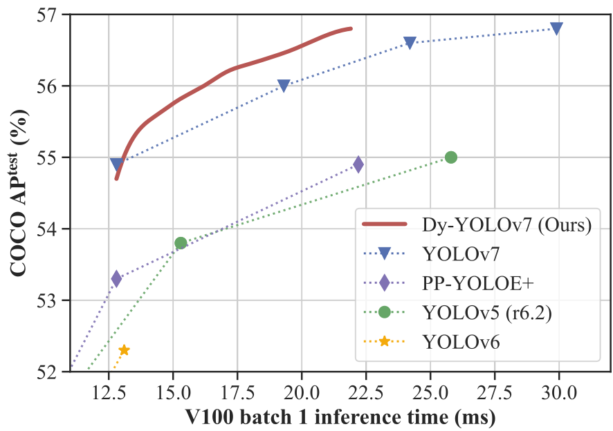

# DynamicDet

This repo contains the official implementation of **"DynamicDet: A Unified Dynamic Architecture for Object Detection"**.

<div align="center">
    <a href="./">
        
    </a>
</div>

## Performance

MS COCO

| Model                                                | Easy / Hard | Size | FLOPs  | FPS  | AP<sup>val</sup> | AP<sup>test</sup> |
| :----------------------------------------------------------- | :---------: | :--: | :----: | :--: | :--------------: | :---------------: |
| [**Dy-YOLOv7**](https://github.com/VDIGPKU/DynamicDet/releases/download/v0.1/dy-yolov7.pt) |  90% / 10%  | 640  | 112.4G | 110  |      51.4%       |       52.1%       |
|                                                              |  50% / 50%  | 640  | 143.2G |  96  |      52.7%       |       53.3%       |
|                                                              |  10% / 90%  | 640  | 174.0G |  85  |      53.3%       |       53.8%       |
|                                                              |  0% / 100%  | 640  | 181.7G |  83  |      53.5%       |       53.9%       |
|                                                              |             |      |        |      |                  |                   |
| [**Dy-YOLOv7-X**](https://github.com/VDIGPKU/DynamicDet/releases/download/v0.1/dy-yolov7x.pt) |  90% / 10%  | 640  | 201.7G |  98  |      53.0%       |       53.3%       |
|                                                              |  50% / 50%  | 640  | 248.9G |  78  |      54.2%       |       54.4%       |
|                                                              |  10% / 90%  | 640  | 296.1G |  65  |      54.7%       |       55.0%       |
|                                                              |  0% / 100%  | 640  | 307.9G |  64  |      54.8%       |       55.0%       |
|                                                              |             |      |        |      |                  |                   |
| [**Dy-YOLOv7-W6**](https://github.com/VDIGPKU/DynamicDet/releases/download/v0.1/dy-yolov7-w6.pt) |  90% / 10%  | 1280 | 384.2G |  74  |      54.9%       |       55.2%       |
|                                                              |  50% / 50%  | 1280 | 480.8G |  58  |      55.9%       |       56.1%       |
|                                                              |  10% / 90%  | 1280 | 577.4G |  48  |      56.4%       |       56.7%       |
|                                                              |  0% / 100%  | 1280 | 601.6G |  46  |      56.5%       |       56.8%       |


<details>
<summary> Table Notes </summary>

- FPS is measured on the same machine with 1 NVIDIA V100 GPU, with `batch_size = 1`, `no_trace` and `fp16`.

- More results can be found on the paper.

</details>


## Quick Start

### Installation

```bash
cd DynamicDet
conda install pytorch=1.11 cudatoolkit=11.3 torchvision -c pytorch
pip install -r requirements.txt
```


### Data preparation

Download MS COCO dataset images ([train](http://images.cocodataset.org/zips/train2017.zip), [val](http://images.cocodataset.org/zips/val2017.zip), [test](http://images.cocodataset.org/zips/test2017.zip)) and [labels](https://github.com/VDIGPKU/DynamicDet/releases/download/v0.1/coco2017labels-segments.zip).

```
├── coco
│   ├── images
│   ├── train2017.txt
│   ├── val2017.txt
│   ├── test-dev2017.txt
│   ├── images
│   │   ├── train2017
│   │   ├── val2017
│   │   ├── test2017
│   ├── labels
│   │   ├── train2017
│   │   ├── val2017
│   ├── annotations
│   │   ├── instances_val2017.json
```

### Training

Step1: Training cascaded detector

- Single GPU training

  ```bash
  python train_step1.py --workers 8 --device 0 --batch-size 16 --epochs 300 --img 640 --cfg cfg/dy-yolov7-step1.yaml --weight '' --data data/coco.yaml --hyp hyp/hyp.scratch.p5.yaml --name dy-yolov7-step1
  ```

- Multiple GPU training (OURS, RECOMMENDED 🚀)

  ```bash
  python -m torch.distributed.launch --nproc_per_node 8 --master_port 9527 train_step1.py --workers 8 --device 0,1,2,3,4,5,6,7 --sync-bn --batch-size 128 --epochs 300 --img 640 --cfg cfg/dy-yolov7-step1.yaml --weight '' --data data/coco.yaml --hyp hyp/hyp.scratch.p5.yaml --name dy-yolov7-step1
  ```

Step2: Training adaptive router

```bash
python train_step2.py --workers 4 --device 0 --batch-size 1 --epochs 2 --img 640 --adam --cfg cfg/dy-yolov7-step2.yaml --weight runs/train/dy-yolov7-step1/weights/last.pt --data data/coco.yaml --hyp hyp/hyp.finetune.dynamic.adam.yaml --name dy-yolov7-step2
```

### Getting the dynamic thresholds for variable-speed inference

  ```bash
python get_dynamic_thres.py --device 0 --batch-size 1 --img-size 640 --cfg cfg/dy-yolov7-step2.yaml --weight weights/dy-yolov7.pt --data data/coco.yaml --task val
  ```

### Testing

  ```bash
python test.py --img-size 640 --batch-size 1 --conf 0.001 --iou 0.65 --device 0 --cfg cfg/dy-yolov7-step2.yaml --weight weights/dy-yolov7.pt --data data/coco.yaml --dy-thres <DY_THRESHOLD>
  ```

### Inference

  ```bash
python detect.py --cfg cfg/dy-yolov7-step2.yaml --weight weights/dy-yolov7.pt --num-classes 80 --source <IMAGE/VIDEO> --device 0 --dy-thres <DY_THRESHOLD>
  ```

## Citation

If you find this repo useful in your research, please consider citing the following paper:

```BibTex
@inproceedings{lin2023dynamicdet,
  title={DynamicDet: A Unified Dynamic Architecture for Object Detection},
  author={Lin, Zhihao and Wang, Yongtao and Zhang, Jinhe and Chu, Xiaojie},
  booktitle={Proceedings of the IEEE/CVF Conference on Computer Vision and Pattern Recognition (CVPR)},
  year={2023}
}
```

## License

The project is only free for academic research purposes, but needs authorization for commerce. For commerce permission, please contact wyt@pku.edu.cn.
